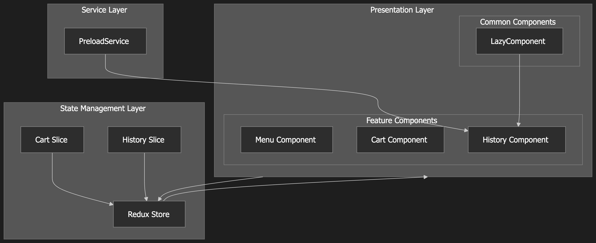
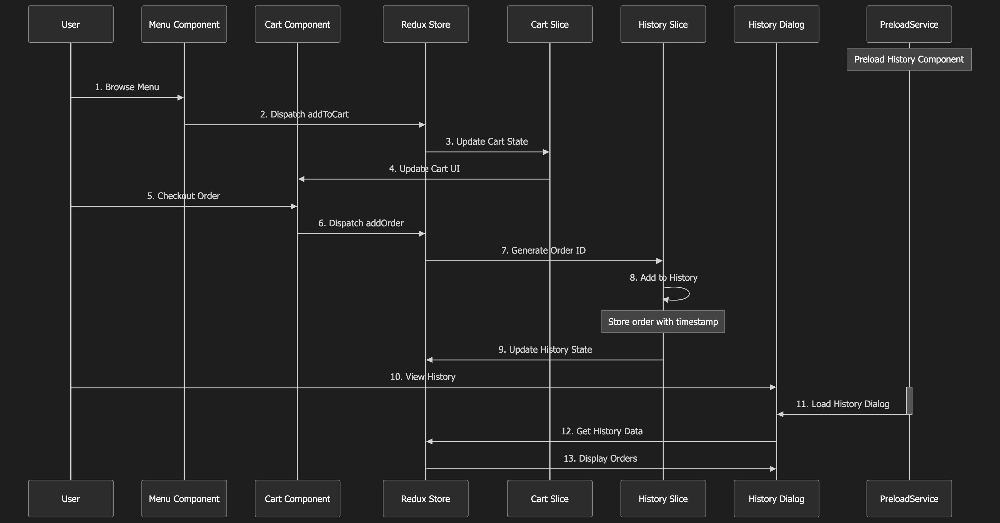
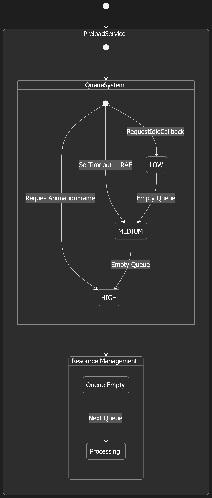
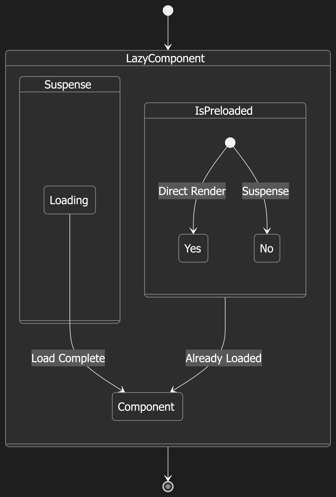

# Food Ordering Application

A modern food ordering system built with React and TypeScript, featuring a sophisticated architecture focused on performance and maintainability.

## Prerequisites

- Node.js (20)
- npm/yarn/pnpm

## Technology Stack

- React 19.0.0
- TypeScript 5.7.2
- Redux Toolkit 2.6.1
- Material UI 6.4.7
- Vite 5.1.4

## Quick Start

```bash
# Install dependencies
npm install

# Start development server
npm run dev

# Build for production
npm run build

# Run tests
npm run test
```

## Architecture Overview

### System Architecture



### Data Flow



### Technical Implementation

#### 1. Advanced Resource Management with PreloadService

The PreloadService implements a sophisticated resource loading strategy that maximizes UI responsiveness through intelligent queue management:

```typescript
class PreloadService {
   [PreloadPriority.LOW]
   [PreloadPriority.MEDIUM]
   [PreloadPriority.HIGH]
}
```




##### Non-blocking Task Execution Strategy

1. **High Priority Tasks**
```typescript
private processHighPriorityQueue(): void {
  requestAnimationFrame(() => {
    task.task().finally(() => {
      task.onComplete?.();
      this.processHighPriorityQueue();
    });
  });
}
```
- Schedules execution in next frame using requestAnimationFrame
- Ensures smooth frame rendering
- Maintains UI responsiveness

2. **Medium Priority Tasks**
```typescript
private processMediumPriorityQueue(): void {
  setTimeout(() => {
    requestAnimationFrame(() => {
      task.task().finally(() => {
        task.onComplete?.();
        this.processMediumPriorityQueue();
      });
    });
  }, 0);
}
```
- Uses setTimeout to schedule in macro task queue
- Ensures frame timing with requestAnimationFrame
- Balances between performance and task priority

3. **Low Priority Tasks**
```typescript
private processLowPriorityQueue(): void {
  requestIdleCallbackPolyfill(() => {
    requestAnimationFrame(() => {
      task.task().finally(() => {
        task.onComplete?.();
        this.processLowPriorityQueue();
      });
    });
  });
}
```
- Utilizes browser idle time
- Graceful fallback when requestIdleCallback is unavailable
- Maximizes main thread availability

##### Intelligent Queue Management

```typescript
private processLowPriorityQueue(): void {
  if (this.lowPriorityQueue.length === 0) {
    this.isProcessing[PreloadPriority.LOW] = false;
    if (this.highPriorityQueue.length > 0) {
      this.processQueue(PreloadPriority.HIGH);
    } else if (this.mediumPriorityQueue.length > 0) {
      this.processQueue(PreloadPriority.MEDIUM);
    }
  }
}
```

The service implements an intelligent queue elevation mechanism:
- Automatically shifts processing to higher priority queues when low priority is empty
- Ensures optimal resource utilization by checking high priority tasks first
- Falls back to medium priority tasks if no high priority tasks exist
- Maintains continuous task processing flow

##### Non-blocking Integration

```typescript
// App.tsx
useEffect(() => {
  // Initialize after initial render
  preloadService.addTask(
    preloadHistoryDialog,
    PreloadPriority.LOW,
    () => setIsHistoryDialogLoaded(true)
  );
  
  // Start processing only after component mount
  preloadService.startPreloading();
}, []);
```

#### 2. Component Communication Architecture

The application implements a clear separation between components and state management:

```typescript
// Component Layer: Pure UI logic
function CartComponent() {
  const dispatch = useDispatch();
  const items = useSelector(state => state.cart.items);
  
  const handleCheckout = () => {
    dispatch(cartActions.checkout());
  };
  
  return <Button onClick={handleCheckout}>Checkout</Button>;
}

// Business Logic Layer: State management
const cartSlice = createSlice({
  name: 'cart',
  initialState,
  reducers: {
    checkout: (state) => {
      const order = createOrder(state.items);
      state.items = [];
      // Trigger history update
      historyActions.addOrder(order);
    }
  }
});
```

Data flow pattern:
- Components handle UI interactions and dispatch actions
- Redux manages all business logic and state updates
- Components react to state changes through selectors

#### 3. Smart Loading Optimization

LazyComponent provides intelligent loading strategy:



```typescript
function LazyComponent({ isLoaded, children }) {
  // Skip Suspense when component is preloaded
  return isLoaded ? (
    children()
  ) : (
    <Suspense fallback={<Loading />}>
      {children()}
    </Suspense>
  );
}

// Usage with History Dialog
const HistoryDialog = lazy(() => import('./HistoryDialog'));

<LazyComponent isLoaded={isHistoryDialogLoaded}>
  {() => showHistory ? <HistoryDialog /> : null}
</LazyComponent>
```

Key benefits:
- Optimizes loading strategy based on preload state
- Prevents unnecessary Suspense fallback renders
- Seamlessly handles both preloaded and lazy-loaded states

## Project Structure

```
src/
├── app/
│   └── services/           # Application-wide services
│       ├── preload.service.ts    # Resource preloading management
│       └── __tests__/           # Service unit tests
├── components/
│   ├── Cart/              # Shopping cart feature
│   │   ├── Cart.tsx           # Cart UI component
│   │   └── __tests__/        # Cart component tests
│   ├── History/           # Order history feature
│   │   ├── History.tsx        # History list component
│   │   ├── HistoryDialog.tsx  # Lazy-loaded dialog
│   │   └── __tests__/        # History component tests
│   ├── Menu/              # Menu display feature
│   │   ├── Menu.tsx          # Menu component
│   │   └── __tests__/        # Menu component tests
│   └── common/            # Shared components
│       ├── LazyComponent.tsx  # Loading optimization
│       └── __tests__/        # Common component tests
├── store/
│   └── slices/            # Redux state management
│       ├── cartSlice.ts      # Cart state & logic
│       ├── historySlice.ts   # History state & logic
│       └── __tests__/        # Store unit tests
├── types/                # TypeScript definitions
└── data/                # Static data sources
